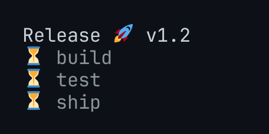

# termoscope

Proof of what a terminal program showed. termoscope runs a binary under a
headless pseudo-terminal inside `go test`, lets you wait for and assert on
screen cells, and leaves a PNG, a static SVG, an animated SVG and an animated
GIF of every run. The same files are the evidence a reviewer or a coding agent
looks at when a test fails, and the demo you put in your README.

<p>
  
  
  
</p>

- **Nothing to install but Go.** No ffmpeg, no ttyd, no browser, no system
  fonts. One `go get`, and it runs the same on a laptop and a bare CI runner.
- **Identical pixels everywhere, color emoji included.** JetBrains Mono,
  Twemoji and Noto Emoji are embedded, so a PNG or GIF rendered on CI matches
  one rendered on a Mac, skin tones, flags and ZWJ sequences included.
- **The test run is the demo.** Every `go test` rewrites its recordings, and
  one `task example` or CI step re-records README media with the same
  renderer, so demos are regenerated from the code instead of hand-captured.
- Real PTY via `charmbracelet/x/xpty`, screen via the pure Go `x/vt`
  emulator. Cell-level reads of text, colors and width. Waits that block on
  screen state instead of sleeping, with the current screen in every timeout
  error.
- Canvas sized in cells, not pixels: `MinCols`/`MinRows` fit the content or
  pin one size across all recordings.
- Artifacts under `test/results/<dateTimeISO>-<testName>/`, plus a
  `termoscope record` CLI for recording outside a test.

## How it compares

| | Real PTY and screen | Assert from Go code | PNG, SVG, GIF output | External tools |
|---|---|---|---|---|
| termoscope | yes | yes, cell-level (`WaitFor`, `CellAt`) | yes, fonts embedded | none |
| [teatest](https://pkg.go.dev/github.com/charmbracelet/x/exp/teatest) | no, in-process Bubble Tea only | yes, model-level | text goldens | none |
| [tuitest](https://github.com/Gaurav-Gosain/tuitest) | yes | yes, text-level | text goldens | none |
| [VHS](https://github.com/charmbracelet/vhs) | yes | no, tape scripts only | GIF, MP4, WebM | ttyd, ffmpeg, Chromium |
| [asciinema](https://asciinema.org) + agg | yes | no | GIF | agg, system fonts |

Use teatest for fast unit tests of a Bubble Tea model. Use VHS for scripted
demos with typing animation and window chrome. Use termoscope when the test
that proves the screen should also leave the picture.

## Install

```sh
go get github.com/dimmkirr/termoscope
go install github.com/dimmkirr/termoscope/cmd/termoscope@latest
```

Requires Go 1.26 and a Unix-like OS that can open PTYs.

## Quick start

This is `test/e2e/example_countdown_test.go`, which drives
`examples/countdown`:

```go
func TestExample_Countdown(t *testing.T) {
	bin := buildCountdown(t) // go build -o <tmp> ../../examples/countdown
	ctx, cancel := context.WithTimeout(context.Background(), 30*time.Second)
	defer cancel()

	tm, err := termoscope.Start(ctx, 40, 4, bin, "-pace=120ms")
	if err != nil {
		t.Fatal(err)
	}
	termoscope.Record(t, tm) // recording.svg written on cleanup

	if _, err := tm.WaitFor(ctx, "Countdown"); err != nil {
		t.Fatal(err)
	}
	termoscope.SavePNG(t, tm, "start")

	if _, err := tm.WaitFor(ctx, "Liftoff"); err != nil {
		t.Fatal(err)
	}
	if err := tm.Wait(); err != nil {
		t.Fatalf("countdown exited with %v", err)
	}
	termoscope.SavePNG(t, tm, "liftoff")
	termoscope.SaveSVG(t, tm, "liftoff")

	for _, x := range []int{11, 13, 15} {
		c := tm.CellAt(x, 0)
		if c == nil || c.Content != "▄" || !isGreen(c.Style.Fg) {
			t.Errorf("cell (%d,0) should be a green tile, got %+v", x, c)
		}
	}
}
```

Run it and look at the evidence:

```sh
go test ./test/e2e/... -count=1 -v
ls test/results/*/
# liftoff.png  liftoff.svg  recording.gif  recording.svg  start.png
```

## Packages

A test imports only the root package. The renderers are separate packages
for programs that want images without `go test` or files.

| Package | Purpose |
|---|---|
| `termoscope` | `Start`, `Terminal` (`Screen`, `Line`, `CellAt`, `Send`, `SendLine`, `WaitFor`, `WaitUntil`, `Done`, `Wait`, `Close`), `StripANSI`, test helpers `Dir`, `SavePNG`, `SaveSVG`, `Record`, `RecordWith` with `Options`, `SetResultsRoot` |
| `raster` | screen to `*image.RGBA` at 2x, pure |
| `svg` | static and animated SVG from recorded frames, pure |
| `gif` | animated GIF from recorded frames, pure |

Full API: https://pkg.go.dev/github.com/dimmkirr/termoscope

`RecordWith(t, tm, termoscope.Options{Hold: 3 * time.Second, MinCols: 20,
MinRows: 4, EmbedEmoji: true})` sets the sampling interval, the hold on the
last frame, the minimum canvas and emoji embedding once for both the SVG and
the GIF.

`Terminal` is safe to read from any goroutine while the program writes.
`CellAt` returns a copy. `WaitUntil` errors include the current screen, so a
failing wait shows what the user would have seen.

Artifacts land under the module root of the test being run, found by walking
up from the working directory to `go.mod`. `SetResultsRoot` overrides that.
Add `test/results/` to `.gitignore`.

## Recorder CLI

```sh
termoscope record -o demo.svg -png last.png -gif demo.gif -cols 80 -rows 24 -- ./myapp --flag
```

Flags: `-sample` (40ms), `-hold` (2s before the loop restarts), `-timeout`
(2m), `-font-size` (16), `-embed-emoji` (off), `-min-cols`/`-min-rows` (0, fit
content; the canvas and background grow to at least this many cells). The
exit code is the child's,
and the recording is written either way.

## SVG rendering

Geometry derives from the font: a cell is one glyph advance wide and two
tall. Block glyphs (`▄ ▀ █`) become rounded cap-height squares, the rule
`─` becomes a thin bar, and text keeps its native spacing. Frames switch
with a CSS keyframe animation, which GitHub renders inside ``. The
font is embedded as a woff2 data URI; browsers honor it, librsvg does not.

## GIF rendering

`Record` also writes `recording.gif`, and `termoscope record -gif out.gif`
does the same from the CLI. Output is hi-DPI (2x) by default; `-gif-scale 1`
or `gif.Options{Scale: 1}` halves it for smaller files. Like the SVG, the
canvas is cropped to the content cells and padded by one cell height on every
side, and so is every PNG from `SavePNG` or `-png`
(`gif.Options.Padding`, `-padding`, in 2x pixels; -1 disables). The blank
screen sampled before the program printed is dropped so static previews of
the GIF show content. Frames are
rasterized with the bundled fonts and encoded with the standard library,
so the result is pixel-exact on every viewer, no browser or system font
involved. The trade-offs against SVG: fixed resolution and a palette of at
most 256 colors (exact when the screen uses few colors, quantized to a
6x6x6 cube plus the 40 most common colors otherwise).

## Emoji

The emulator gives emoji two columns, and all renderers keep the grid:
text after an emoji lands on its true column.

The bundled fonts and Twemoji pictures add about 5 MB to the binary.

- **PNG and GIF** draw emoji in color from the bundled Twemoji pictures,
  looked up by the cell's whole grapheme cluster, so skin tones, flags and
  ZWJ sequences (👍🏽 🇨🇿 👨‍👩‍👧) render correctly with no text shaping
  and no system font. A cell counts as emoji when it is two columns wide,
  contains U+FE0F, or JetBrains Mono lacks its first code point, so `#`,
  `*` and `©` stay text. `raster.Options{MonoEmoji: true}`,
  `gif.Options{MonoEmoji: true}` or `-mono-emoji` switch to the
  monochrome Noto Emoji face tinted with the cell's foreground; it is also
  the fallback for anything Twemoji has no picture for.
- **SVG** emits each emoji as its own centered `<text>` and lists the
  platform color emoji fonts after JetBrains Mono: Twemoji Mozilla
  (Firefox), Apple Color Emoji (macOS, iOS), Segoe UI Emoji and Segoe UI
  Symbol (Windows), Noto Color Emoji (Android, ChromeOS, Linux), EmojiOne
  Color and Android Emoji (legacy). Browsers only consult them for glyphs
  JetBrains Mono lacks, so a README on GitHub shows the viewer's native
  color emoji. For a render that is identical everywhere, set
  `svg.Options{EmbedEmoji: true}` or pass `-embed-emoji`: the
  monochrome Noto Emoji is embedded as a woff data URI, adding about
  750 KB.

## Testing

```sh
CC=cc go test -race ./...   # nix: cgo needs the clang wrapper
golangci-lint run ./...
```

`svg` has two browser tests that render SVGs with headless Chromium to
prove the embedded fonts (JetBrains Mono, and Noto Emoji with `EmbedEmoji`)
are what the browser draws. They skip when no Chromium or Chrome is on
`PATH`.

## Consumers

- [go-streak-chart](https://github.com/dimmkirr/go-streak-chart), where this
  code was extracted from.

## License

MIT. JetBrains Mono and Noto Emoji are bundled under the SIL Open Font
License 1.1, see `internal/fonts/OFL.txt` and
`internal/fonts/OFL-NotoEmoji.txt`. Emoji pictures are
[Twemoji](https://github.com/jdecked/twemoji) 17.0.3 graphics, licensed
under [CC-BY 4.0](https://creativecommons.org/licenses/by/4.0/), see
`internal/twemoji/LICENSE-GRAPHICS`.
